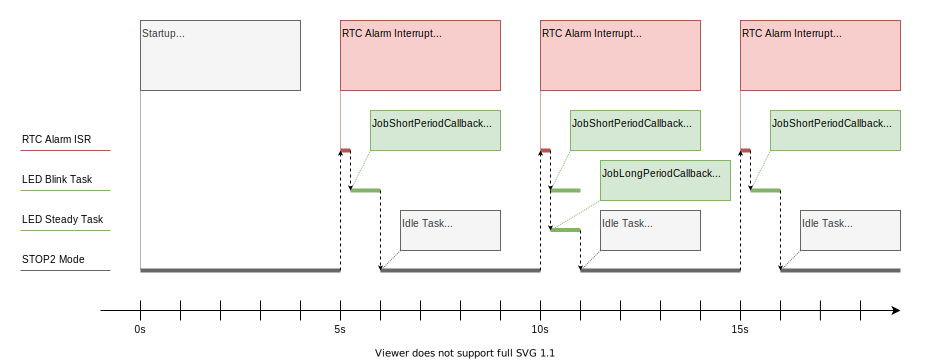

# STM32 RTC Scheduler

This project demonstrates how to implement an RTC-based scheduler for ultra-low
power applications, where recurring tasks are needed to be executed with long
periods.

Increasing number of applications, including IoT applications use real-time
operating systems (RTOS) due to the ever-increasing complexity. However,
achieving truly ultra-low power consumption while utilizing an RTOS is not
trivial. This example uses FreeRTOS to show how to combine the RTC Scheduler
with an RTOS, while maintaining ultra-low power dissipation when the device is
in low power mode.

The RTC Scheduler is demonstrated on the STM32L496-Discovery board
[[1]](#references).

Please refer to <https://akospasztor.github.io/stm32-rtc-scheduler> for complete
documentation of the source code.


## Table of Contents
- [Scheduler Operation](#scheduler-operation)
- [Example Application](#example-application)
- [Source Code Organization](#source-code-organization)
- [Compile and Build](#compile-and-build)
- [References](#references)

## Scheduler Operation
The RTC Scheduler uses the Real-Time Clock peripheral to implement an efficient
scheduling mechanism. It has a configurable alarm feature that can be configured
to generate an interrupt on a specific date, with sub-second precision.
Furthermore, the RTC has the advantage of being able to run even in ultra-low
power consumption modes of the microcontroller.

The RTC Scheduler can be configured to schedule several, recurring jobs. The
phrase "job" is used throughout this demonstration for _tasks_ that are
scheduled by the RTC Scheduler and the expression "task" is reserved for the
actual tasks of the RTOS.

Upon launching the Scheduler, it checks all jobs and selects the job that needs
to be executed the earliest. Then it configures an RTC alarm with the required
date and time when the application needs to execute this job. If nothing else is
to be done, the application can put the microcontroller into an ultra-low power
mode. The RTC peripheral generates an alarm interrupt, thus waking up the
microcontroller from the low power mode when the earliest job is due for
execution.

After wakeup, the Scheduler checks all the jobs and marks those which are due
for execution, i.e. their remaining time until next execution is zero. Then, the
Scheduler adjusts the remaining time of all jobs and schedules the next job that
needs to be executed by configuring and setting the RTC alarm to the next wakeup
time. Afterwards the application processes the jobs that are pending for
execution. If the application is done with all its operation and has nothing
else to do until the next wakeup, it can put the microcontroller again into an
ultra-low power mode and wait for the next RTC alarm interrupt.

## Example Application
The example application utilizes FreeRTOS as its real-time operating system and
it has two demo tasks. The first task blinks the `LD3` LED on the discovery
board twice with a 0.5 second period. The second task turns on the `LD2` LED for
1 second, leaves it on, then turns it off. After executing their operations,
each task waits and blocks for a so-called task notification [[2]](#references)
to be unblocked again.

The goal of this demonstration is to unblock the first task and execute it with
a period of 5 seconds, and unblock the second task and execute it with a period
of 10 seconds. During the time when nothing else is to be done, i.e. no task is
to be executed by the RTOS, the microcontroller is put into the STOP2 ultra-low
power mode, where it consumes less than 3 uA with the RTC enabled and running.



_Figure 1: STM32 RTC Scheduler_

### Detailed Description

After startup, the application configures all the required peripherals,
including the system clocks, GPIOs and the RTC peripheral. Then it configures
the scheduler with two jobs:

1. A job with 5 second period with a callback function that unblocks the first
   RTOS task that blinks the `LD3` LED twice.
2. A job with 10 second period with a callback function that unblocks the second
   RTOS task that turns on the `LD2` LED for one second.

Then the application configures the two RTOS tasks and launches the RTOS. Right
after the RTOS starts, the RTOS startup hook is immediately called once by the
kernel. In this hook, the RTC Scheduler is started by processing it the first
time and the RTC alarm is configured to generate an interrupt for the job that
needs to be executed the earliest.

The RTOS idle task is run by the RTOS kernel if nothing else is to be done.
Every time the idle task runs, it checks what is the expected idle time of the
RTOS kernel. If this expected idle time is greater than 1 second, furthermore
the delayed task list of the RTOS is empty, the application puts the
microcontroller into the STOP2 ultra-low power mode by pausing the RTOS tick
(the SysTick), deinitializing all peripherals (except the RTC), resetting the
system clock to 4 MHz (clocked directly by the MSI clock) and finally executing
the `WFI` instruction.

_Note:_ In order to perform the above checks in the idle task, the RTOS kernel
had to be extended by two additional functions. These additions can be found in
the `freertos_tasks_c_additions.h` file which is automatically included at the
end of the `tasks.c` file of FreeRTOS. For more information, please refer to the
`tasks.c` file.

When the RTC alarm interrupt arrives, the application resumes its operation by
reconfiguring the microcontroller clocks and peripherals and enabling the RTOS
tick. Within the RTC interrupt context, the RTC Scheduler is immediately
processed, thus the RTC alarm is configured to generate the next wakeup
interrupt when the next job is due and flags the jobs that need to be executed.

The application executes the pending jobs that are flagged for execution within
the interrupt service routine, by calling the `SchedulerExecutePendingJobs()`
function. This requires that the callbacks of all jobs are written to be
executed from an interrupt context, meaning that they do not block, furthermore
they only call interrupt-safe FreeRTOS API functions.

Depending on the application requirements, the execution of the pending jobs can
be performed from task context as well. This can be useful if the job callbacks
are required to block, or they need to call FreeRTOS API functions that are not
interrupt-safe. In this case, the execution of the
`SchedulerExecutePendingJobs()` function can be deferred to an RTOS task. This
method is called _Deferred Interrupt Processing_ [[3]](#references).

After executing the callbacks of the pending jobs, the respective FreeRTOS tasks
are unblocked and run. If there is no more operation left and no task is ready
to be run, the idle task of the RTOS puts the microcontroller again into STOP2
mode and waits for the next RTC alarm interrupt.

## Source Code Organization
```
Repository
├── docs
├── drivers
│   ├── CMSIS
│   └── STM32L4xx_HAL_Driver
├── include
├── lib
│   └── FreeRTOS
├── projects
│   ├── EWARM
│   ├── GCC
│   └── MDK-ARM
├── python
├── source
└── tests
```

The `docs` folder contains the generated documentation of the RTC Scheduler
source code and other documentation-related static files.

The `drivers` folder contains the CMSIS (Cortex Microcontroller Software
Interface Standard) as well as the HAL (Hardware Abstraction Layer) drivers from
ST.

The RTC Scheduler source code and corresponding header files can be found in the
`source` and `include` folders respectively.

The `lib` folder contains the source code of FreeRTOS.

The `projects` folder contains compiler and SDK-specific files organized in
subfolders for IAR, Keil and GCC for ARM toolchains.

The `python` folder contains helper scripts and the `test` folder contains tests
for the project.

## Compile and Build
The project can be compiled and built out-of-the-box with IAR EWARM, Keil
MDK-ARM and GNU Arm Embedded Toolchain. The IAR EWARM and Keil uVision projects
are already configured with the required parameters and options in order to
compile and build the application with a single click.

### IAR EWARM
1. Open the `Project.eww` workspace file with IAR.
2. Configure the debugger within the project options.
3. Build the project and download to the target.

### Keil uVision
1. Open the `stm32-rtc-scheduler.uvprojx` project file with uVision.
2. Configure the debugger within the project options.
3. Build the project and download to the target.

### GNU Arm Embedded Toolchain
The `GCC` subfolder contains the compiler-specific files, a `Makefile` and a
`SConscript` file to easily compile and build the project with the GNU Arm
Embedded Toolchain.

Prerequisites:
- GNU Arm Embedded Toolchain, tested version: 8-2019-q3-update
- At least one of the followings:
    - GNU Make (for Windows, see:
      [Make for Windows](http://gnuwin32.sourceforge.net/packages/make.htm))
    - Python with pip

#### Build with Make
Steps to compile and build with GNU Make:

1. If the GNU Arm Embedded Toolchain has not been added to PATH: Edit the
   `CUSTOMPATH` variable in the `Makefile` so that it points to the `bin` folder
   of the installed GNU Arm Embedded Toolchain.
2. Open up your favorite terminal and navigate to the `GCC` subfolder where the
   makefile is located.
3. Type `make` and hit enter.
4. The `build` subfolder should contain the binary, ELF and HEX output files,
   named `stm32-rtc-scheduler.bin`, `stm32-rtc-scheduler.elf` and
   `stm32-rtc-scheduler.hex` respectively.

#### Build with SCons
This project currently supports two build configurations: debug (default) and
release. Follow these steps to compile and build the project with SCons. Please
note that the recommended usage is within a virtualenv.

1. Install the requirements: `pip install -r requirements.txt`
2. If the `bin` folder of the GNU Arm Embedded Toolchain does not exist in the
   PATH, it can be specified in the `SConstruct` file.
3. To build the project with the default debug configuration, execute:
   `scons -j8`
4. To build all build configurations at once, execute: `scons --all -j8`
5. To list all supported arguments, execute: `scons --help`
6. The `build` subfolder should contain the generated outputs, organized in
   subfolders with the names of the build configurations.

## References
[1] Discovery kit with STM32L496AG MCU,
https://www.st.com/en/evaluation-tools/32l496gdiscovery.html

[2] FreeRTOS Task Notifications,
https://www.freertos.org/RTOS-task-notifications.html

[3] Deferred Interrupt Processing,
https://www.freertos.org/deferred_interrupt_processing.html
